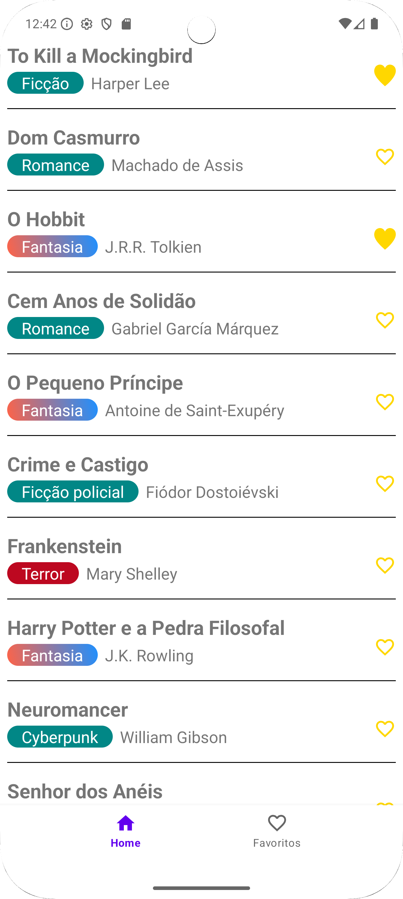
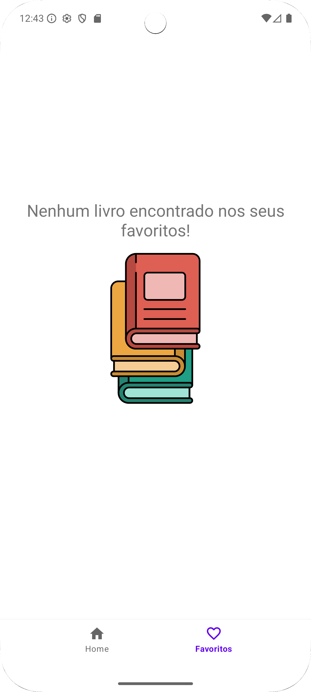
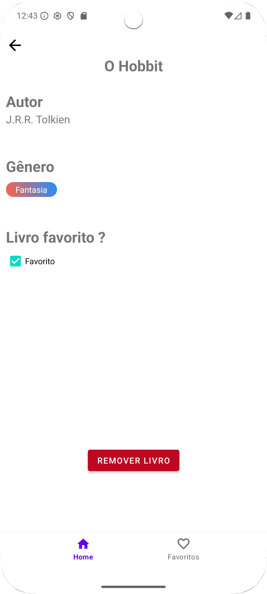
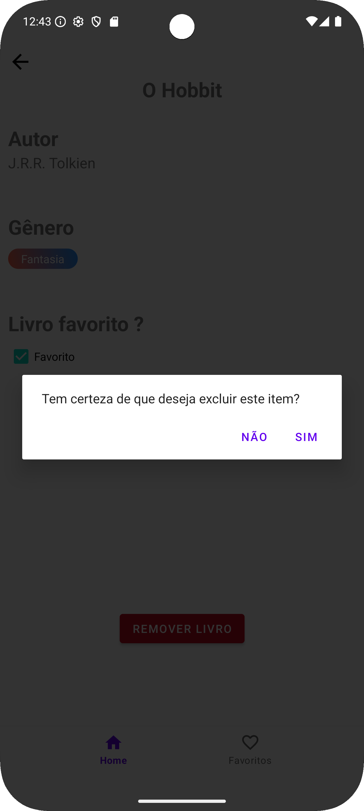

# 📚 BooksApp

Este é um aplicativo Android desenvolvido em Kotlin, utilizando a arquitetura MVVM, que permite gerenciar uma coleção de livros, marcar favoritos e visualizar detalhes dos livros. O app conta com navegação entre telas, lista de livros, favoritos e detalhes de cada livro.

## Funcionalidades

- Listar todos os livros disponíveis  
- Marcar e desmarcar livros como favoritos  
- Visualizar detalhes completos de cada livro  
- Remover livros da lista  
- Exibir lista separada apenas com os livros favoritos  
- Navegação intuitiva via Bottom Navigation  

## Tecnologias utilizadas

- Kotlin  
- Android Jetpack (ViewModel, LiveData, Navigation)  
- RecyclerView  
- MVVM (Model-View-ViewModel)  
- Git para controle de versão  

---

## Prints do aplicativo

🏠 Tela Inicial  

✅ Favoritos Encontrados  

⭐ Favoritos (Nenhum Encontrado)  

📖 Tela de Detalhes  

🗑️ Confirmação de Exclusão  

---

## Como executar

1. Clone este repositório  
2. Abra no Android Studio  
3. Compile e rode no emulador ou dispositivo físico Android  

---

## Contato

Matheus Rian Souza  
[Meu GitHub](https://github.com/Rian144hz)  
[Meu LinkedIn](https://www.linkedin.com/in/matheus-souza7/)  

---

Desenvolvido com dedicação e foco na aprendizagem do desenvolvimento Android. 🚀
